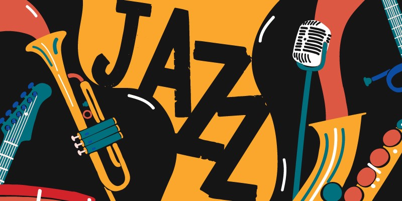
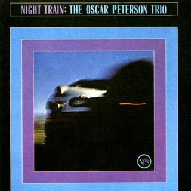

## Jazz it up
  Recently my love for jazz music has overflowed, especially for jazz piano🎹. After watching the masterclass of jazz legend *Herbie Hancock*, there was a particular quote that truly inspired me.
  > During the process of learning how to do something you haven't done before, is just to see how other people have done it, copy them. There's a point where you'll have your own voice.  
  >   
  > *-Herbie Hancock*
  
  which I strongly resonate with and makes me think of curating my own jazz music playlist. I'm putting together this playlist not only for the purpose of listening, but also with the intention of examining the different styles of different jazz performers\songwriters and incorporating their techniques, in order to find the elements helpful to my own playing.

## Jazz Artists
- Oscar Pererson
- Nat King Cole
- BB King
- Les MacCann
- Horace Silver
- Louis Armstrong

## Oscar Perterson
最干净清爽的一位爵士作曲家/演奏家，目前和我的风格最match。他的曲子中编曲基本上是`鼓`和`钢琴`，没有`vocal`和`管弦乐`。
### Favorite Album

  
    *Night Train - Oscar Peterson - 1963*

- Things Ain't What They Used to Be
- I Got It Bad(And That Ain't Good)
- Georgia On My Mind

## To Be Continued
...